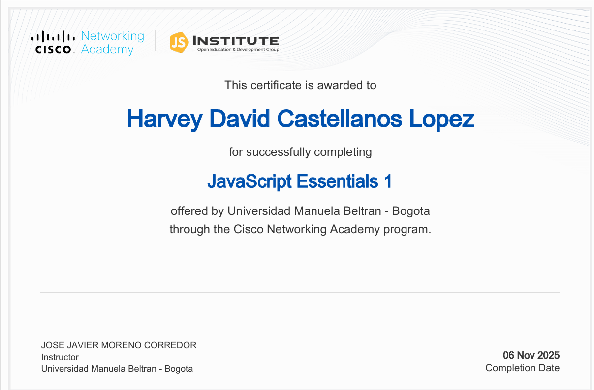
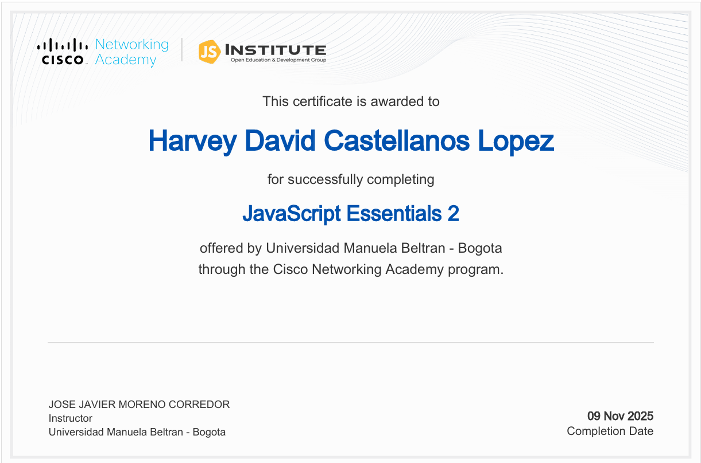

 

<h2>💻 Software Engineer · 🌐 Full Stack </h2>

Desarrollo soluciones <strong>seguras</strong>, <strong>escalables</strong> y bien estructuradas. 
Enfocado en backend, arquitectura y buenas prácticas.

 

<!-- Core Skills -->

---

## 👨‍💻 Perfil profesional

- 🎓 Estudiante de **Ingeniería de Software**
- 🌐 Desarrollo **Full Stack**, con énfasis en backend
- ⚙️ Diseño de **APIs REST**, autenticación y automatización
- 🧠 Pensamiento analítico y orientación a calidad

---

## 🛠️ Stack tecnológico

| Categoría | Tecnologías |
|---------|------------|
| **Lenguajes** | Python · JavaScript · TypeScript · Java · SQL |
| **Frontend** | HTML · CSS · React · Tailwind |
| **Backend** | Node.js · NestJS · Express · Flask |
| **Bases de datos** | MySQL · PostgreSQL · MongoDB |
| **Herramientas** | Git · Linux · Docker · Postman |

---

## 📜 Certificaciones

<table>
<tr>
<td align="center">
 
<strong>JavaScript Fundamentals</strong>
</td>

<td align="center">
 
<strong>Advanced JavaScript</strong>
</td>
</tr>
</table>

---

## 📊 GitHub Analytics

---

## 🧠 Áreas de trabajo

- 🔹 Aplicaciones **Full Stack**
- 🔹 Backend con **NestJS**
- 🔹 Autenticación y control de acceso
- 🔹 Automatización con Python
- 🔹 Fundamentos de **pentesting**

---

## 🌎 Contacto

---

<i>“Cuando admiras no es porque te guste, es porque reconoces grandeza.”</i>

