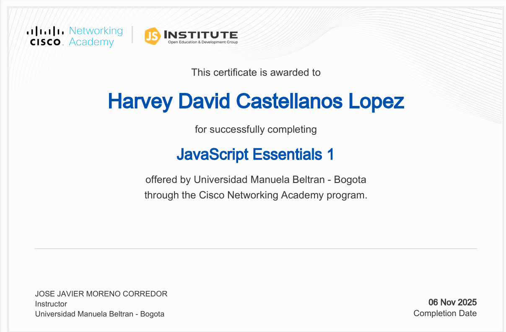
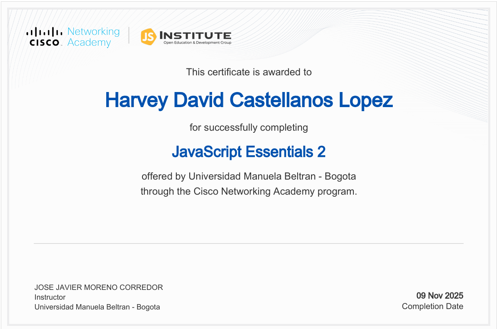

 

<h2>💻 Software Engineer · 🌐 Full Stack </h2>

I build <strong>secure</strong>, <strong>scalable</strong>, and well-structured solutions. 
Focused on backend development, architecture, and best practices.

 

<!-- Core Skills -->

---

## 👨‍💻 Professional Profile

- 🎓 **Software Engineering** student  
- 🌐 **Full Stack** development with a focus on backend  
- ⚙️ Design of **REST APIs**, authentication systems, and automation  
- 🧠 Analytical thinking and quality-oriented development  

---

## 🛠️ Technology Stack

| Category | Technologies |
|---------|------------|
| **Languages** | Python · JavaScript · TypeScript · Java · SQL |
| **Frontend** | HTML · CSS · React · Tailwind |
| **Backend** | Node.js · NestJS · Express · Flask |
| **Databases** | MySQL · PostgreSQL · MongoDB |
| **Tools** | Git · Linux · Docker · Postman |

---

## 📜 Certifications

<table>
<tr>
<td align="center">
 
<strong>JavaScript Fundamentals</strong>
</td>

<td align="center">
 
<strong>Advanced JavaScript</strong>
</td>
</tr>
</table>

---

## 📊 GitHub Analytics

---

## 🧠 Work Areas

- 🔹 **Full Stack** applications  
- 🔹 Backend development with **NestJS**  
- 🔹 Authentication and access control  
- 🔹 Automation with Python  
- 🔹 **Pentesting** fundamentals  

---

## 🌎 Contact

---

<i>"When you admire someone, it's not just because you like them — it's because you recognize greatness."</i>

