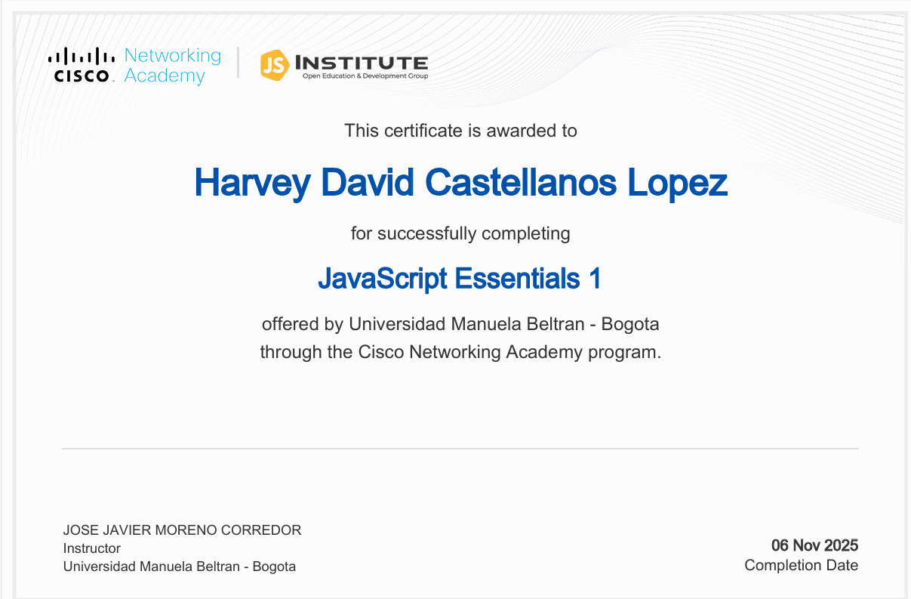
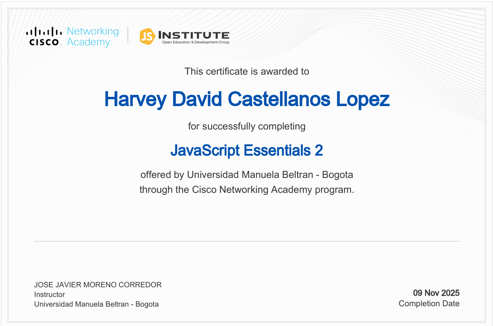

<!-- Animated Header -->

 

<h3>💻 Software Engineer · 🌐 Full Stack Developer · ⚡ Optimization & Security</h3>

I build <strong>secure</strong>, <strong>scalable</strong>, and <strong>mathematically optimized</strong> software solutions. 
Focused on backend architecture, constraint optimization algorithms, REST APIs, and modern web applications.

<!-- Tech Badges -->

  
  
  
  
  
  
  

---

## 👨‍💻 About Me

- 🎓 **Software Engineering** Student with a strong focus on backend architecture and algorithm design.
- 🚀 **Full Stack Developer** experienced in building production-ready systems and mathematical solvers.
- ⚙️ Skilled in **REST API Design**, **Linear Programming / Optimization (PuLP)**, authentication, and database modeling.
- 🛡️ Passionate about **Software Security**, clean code practices, and **Pentesting fundamentals**.
- 🌐 Currently developing custom solutions as a **Freelance Web Developer**.

---

## 🚀 Featured Projects & Work Experience

| Project | Description | Tech Stack | Link / Status |
| :--- | :--- | :--- | :---: |
| 📅 **OptiHorarios (Proyecto Panda)** | Automatic academic schedule generation engine using linear integer programming (PuLP) to solve complex timetable constraints automatically. | `Python (PuLP)` `Node.js` `Supabase` `React + Vite` `Render` | 🟢 Active Project |
| 🇨🇭 **Amrein Begleitung** | Professional fullstack web platform developed for a Swiss consultancy client, optimized for performance, security, and responsive UI. | `React` `Tailwind` `Node.js` `SEO & Security` | 🌐 [Visit Site](https://amrein-begleitung.ch) |

---

## 🛠️ Technology Stack

| Category | Technologies |
|---|---|
| **Languages** | Python · JavaScript (ES6+) · TypeScript · Java · SQL |
| **Backend & APIs** | Node.js · NestJS · Express · Flask · RESTful APIs |
| **Algorithms & Optimization** | Linear Programming (PuLP) · Constraint Solvers · Data Structures |
| **Frontend** | React · Vite · Tailwind CSS · HTML5 · CSS3 · Lucide Icons |
| **Databases & Cloud** | PostgreSQL · Supabase · MySQL · MongoDB · Render |
| **DevOps & Tools** | Git · Docker · Linux · Postman · npm / pip |
| **Security** | Pentesting Fundamentals · JWT Auth · Web Security |

---

## 📊 GitHub Analytics

&nbsp;

---

## 📜 Certifications

<table>
<tr>
<td align="center">
 
<strong>JavaScript Fundamentals</strong>
</td>
<td align="center">
 
<strong>Advanced JavaScript</strong>
</td>
</tr>
</table>

---

## 📬 Connect With Me

&nbsp;

---

<i>"When you admire someone, it's not just because you like them — it's because you recognize greatness."</i>

